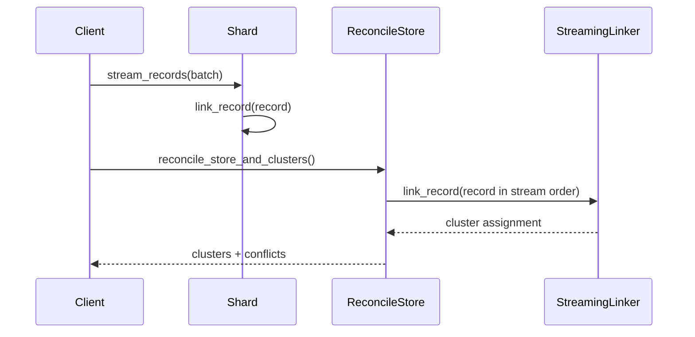

# Design

## Goals

- Stream records and resolve entity clusters with interval-aware constraints.
- Detect conflicts and preserve temporal provenance in the knowledge graph.
- Provide conflict-aware query results for master entities over time.
- Keep storage pluggable (in-memory now, Minitao persistence supported).
- Support sharded ingestion with deterministic reconciliation.

## Core data flow

1. Ingest records into the store.
2. Stream records through the linker to assign clusters.
3. Detect conflicts (direct, indirect, constraint violations).
4. Incrementally update the knowledge graph.
5. Persist graph state to Minitao (optional).
6. Serve queries for descriptors over time.
7. Optionally reconcile sharded ingests into a single store snapshot.

## Key modules

- `store`: in-memory record storage and attribute/value interning.
- `linker`: streaming entity resolution with temporal DSU and identity-key indexing.
- `conflicts`: conflict detection and constraint violations.
- `graph`: knowledge graph snapshots and incremental updates.
- `query`: conflict-aware master-entity queries.
- `minitao_store` / `minitao_grpc`: persistence to Minitao (local or gRPC).
- `sharding`: parallel streaming ingest and reconciliation.
- `profile`: lightweight hot-path profiler (feature gated).

## Streaming resolution

- `StreamingLinker` assigns each new record to an existing cluster or creates a new one.
- Identity keys generate candidate pairs; merges are blocked when strong identifiers conflict over overlapping intervals.
- Clusters are maintained in a temporal DSU with merge guards.
- Conflict splitting is applied only in narrow cases required by tests.
- Batch processing is intentionally removed; streaming is the single execution mode.
- Streaming behavior is tunable via `StreamingTuning` (cap thresholds, adaptive cap, deferred reconciliation).
- `StreamingTuning::from_profile` provides named presets: Balanced, LowLatency, HighThroughput, BulkIngest, MemorySaver.

## Sharding and reconciliation

Sharded ingestion assigns records to shards by entity type plus identity-key hash. Each shard
runs streaming resolution locally, then reconciliation replays records in original stream order
into a single store to produce the final clusters and conflicts.

```mermaid
flowchart LR
  subgraph Ingest["Sharded ingest"]
    R[Record stream] --> Hash[Identity key hash]
    Hash -->|Shard 0| S0[Shard 0\nStreamingLinker]
    Hash -->|Shard 1| S1[Shard 1\nStreamingLinker]
    Hash -->|Shard N| SN[Shard N\nStreamingLinker]
  end

  S0 --> RS[Reconcile store]
  S1 --> RS
  SN --> RS

  RS --> Replay[Replay records\n(original stream order)]
  Replay --> Final[Final clusters + conflicts]
```



## Conflict model

- Direct conflicts: overlapping descriptors with different values.
- Indirect conflicts: suppressed merges due to strong identifier conflicts.
- Constraint violations: unique and unique-within-perspective constraints.

## Knowledge graph

- Nodes: record nodes and cluster nodes.
- Edges: SAME_AS for merges and CONFLICT edges for conflict observations.
- Graph updates are incremental and derived from streaming clusters + observations.
- Cluster nodes persist a golden copy: conflict-free attribute/value intervals derived from cluster records.
- Cluster nodes include a stable cluster key derived from entity-type key attributes (or identity keys by default).
- Cluster nodes persist the golden copy so UI and queries consume a single authoritative view.

## Query model

`query_master_entities` accepts a set of descriptors and a time interval.

- Computes per-cluster intervals where all descriptors apply.
- Coalesces intervals per cluster.
- Returns a `QueryOutcome`:
  - `Matches`: non-overlapping cluster intervals.
  - `Conflict`: overlapping clusters with per-descriptor overlap intervals.
- Match entries include the cluster golden copy filtered to the match interval for rendering.
- Match entries include a `cluster_key` label to make clusters human-readable.
- Cluster keys use the ontology-defined key fields per entity type; the minimal prefix that makes the cluster unique is used, plus a 2-character hash suffix.

The query outcome enforces the invariant: at any time instant, at most one master entity is returned.

## Minitao persistence

- Storage writer maps graph nodes to Minitao objects.
- SAME_AS associations are aggregated by record pair.
- Conflict edges are stored as objects with associations from each record to the conflict object.
- gRPC writer supports the same payloads for server-backed persistence.

## Invariants

- Intervals are half-open [start, end) and must satisfy start < end.
- Strong identifiers may not conflict within overlapping intervals.
- Query results must not return multiple masters for the same time instant.
- Sharded reconciliation must match single-stream results for clusters and conflicts.

## Performance notes

- Identity key lookups use borrowed keys to avoid allocations.
- Streaming resolution prioritizes incremental updates over batch processing.
- Benchmarks isolate linker cost from record generation.
- Store maintains attribute/value and temporal indexes for interval lookups.
- Query execution uses indexed attribute/value lookups plus per-cluster interval intersection.
- Sharded ingestion partitions by entity type + identity key hash; reconciliation replays records in original stream order.
- Reconciliation seeds interners to keep attribute/value IDs aligned across shards.
- Optional profiling prints hot-path timings for targeted optimizations.
- Candidate caps + deferred reconciliation reduce candidate scans in hot identity-key buckets.

## Testing

- Unit tests cover conflicts, DSU behavior, indexing, graph export, and queries.
- E2E script validates gRPC persistence against a live Minitao server.
- Sharded reconciliation tests assert equivalence with single-stream conflicts and clusters.

## Scaling constraints and next steps

To reach billions of entities, we need to push more work into indexed, incremental paths
and avoid global scans:

- Replace in-memory `Store` with a sharded persistence layer (Minitao/other DB) that can
  serve attribute-value and identity-key lookups in O(log n) per descriptor.
- Maintain cluster-level summaries (golden copy + active attribute intervals) in the
  persistence layer to avoid re-walking all records for query and conflict checks.
- Partition workloads by entity type and identity key to enable parallel ingestion and
  reduce hotspot keys.
- Add streaming invalidation for clusters impacted by a new record (descriptor-level
  delta updates rather than full conflict scans).
