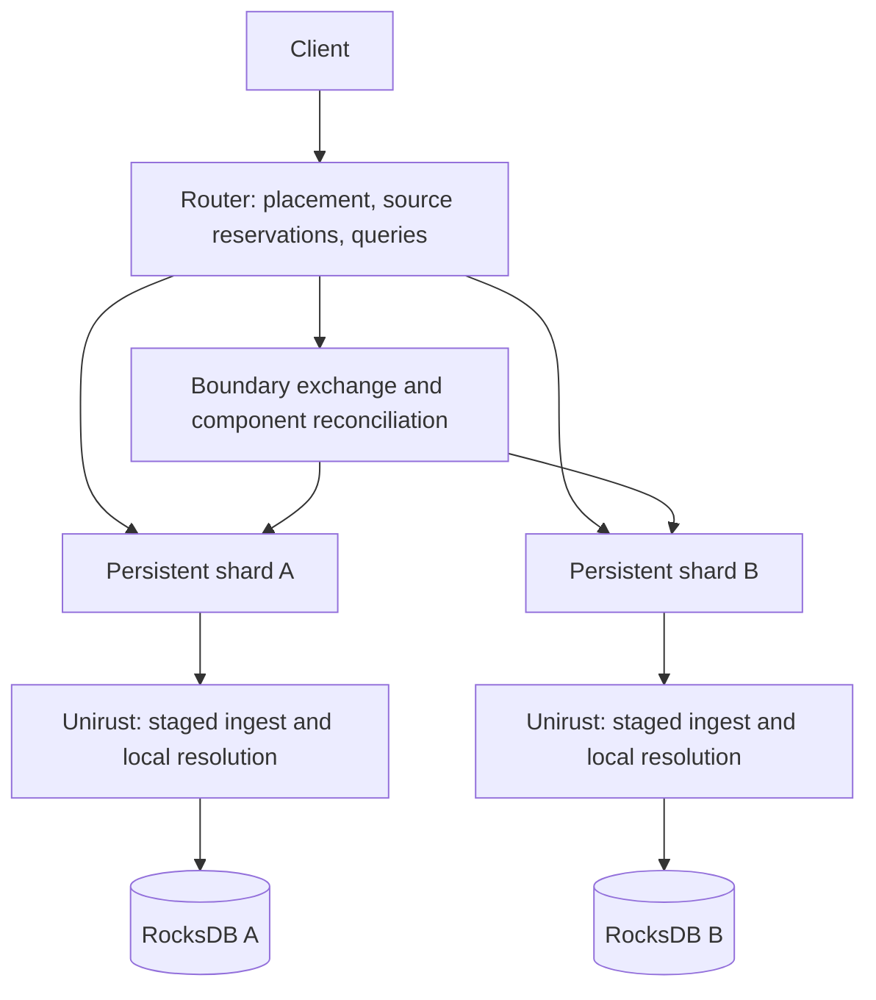

# Unirust architecture and design

This document describes the implementation in this repository for v0.2.0. Source
links identify the code behind each design choice. Configuration profiles and
performance-oriented module names describe mechanisms, not capacity or latency
guarantees.

## Runtime structure

The public Rust API is `Unirust`. A distributed deployment places a router in
front of shards, each of which owns a `Unirust` instance and, when configured with
a data directory, a `PersistentStore` backed by RocksDB.

```mermaid
flowchart TD
    Client[Client] --> Router[Router: placement, source reservations, queries]
    Router --> ShardA[Persistent shard A]
    Router --> ShardB[Persistent shard B]
    ShardA --> EngineA[Unirust: staged ingest and local resolution]
    ShardB --> EngineB[Unirust: staged ingest and local resolution]
    EngineA --> DBA[(RocksDB A)]
    EngineB --> DBB[(RocksDB B)]
    Router --> Reconciliation[Boundary exchange and component reconciliation]
    Reconciliation --> ShardA
    Reconciliation --> ShardB
```

| Code | Responsibility |
| --- | --- |
| [`src/lib.rs`](src/lib.rs) | Public API, ingest lifecycle, backend selection, recovery, query execution |
| [`src/linker.rs`](src/linker.rs) | Candidate linking, strong-ID summaries, local membership, global redirects |
| [`src/dsu.rs`](src/dsu.rs) | Union-find backends and merge guards |
| [`src/index.rs`](src/index.rs) | Temporal identity-key extraction and in-memory/tiered candidate indexes |
| [`src/persistence.rs`](src/persistence.rs) | Durable records, indexes, string interning, metadata and checkpoints |
| [`src/distributed.rs`](src/distributed.rs) | Router/shard services, ingest WAL, replication and distributed queries |
| [`src/sharding.rs`](src/sharding.rs) | Boundary metadata and guarded component reconciliation |
| [`src/query.rs`](src/query.rs), [`src/graph.rs`](src/graph.rs) | Query intervals, golden descriptors and display keys |
| [`src/conflicts.rs`](src/conflicts.rs) | Conflict observations and summaries |
| [`proto/unirust.proto`](proto/unirust.proto) | External and internal RPC contracts |

A persistent shard explicitly disables the optional partitioned ingest path.
`Partition` stores in [`src/partitioned.rs`](src/partitioned.rs) are in memory;
routing durable traffic through them would bypass the shard's authoritative
record store. The partitioned implementation remains a separate path available
to non-persistent shards. It is not the persistent production ingest architecture.
See `ShardNode::new_with_storage_paths` in [`distributed.rs`](src/distributed.rs).

## Records, time and matching rules

A record has a shard-local `RecordId`, a source identity
`(entity_type, perspective, uid)`, and descriptors. Each descriptor contains an
interned attribute ID, an interned value ID and a validity interval. Interned IDs
are local to the store/interner; distributed requests and boundary strong-ID
observations carry string values where agreement across stores is required.
See [`model.rs`](src/model.rs) and [`ontology.rs`](src/ontology.rs).

Intervals are half-open: `[start, end)`. Valid intervals require `start < end`;
adjacent intervals do not overlap. `Interval` also provides unbounded interval
constructors, represented with the extreme `i64` endpoints. Descriptor validity
is separate from the time at which the record arrives. See
[`temporal.rs`](src/temporal.rs).

An identity key names attributes whose values must match during a shared time
interval. Extraction coalesces equal values, intersects intervals across key
attributes, and produces complete key tuples. Missing attributes do not form a
complete identity key. Candidate buckets include the entity type, so records of
different entity types are not matched through the same bucket. The current
`Ontology::identity_keys_for_type` and `strong_identifiers_for_type` return the
configured rule lists for every entity type; they do not implement independent
per-type rule selection. Entity-specific `key_attributes` select display-key
attributes, not separate matching rules.

Strong-ID merge guards compare the accumulated observations of both clusters.
A conflicting observation has the same perspective and attribute, a different
value, and an overlapping validity interval. Thus two different SSNs reported
by the same source during overlapping periods block a merge. Different sources
may report different values without triggering this particular guard; values
from the same source in disjoint periods can also coexist. The guard applies
to cluster histories, including records that are not the immediate matching
pair. See `build_record_summary`, `cluster_summaries_conflict` and
`would_create_conflict_in_clusters` in [`linker.rs`](src/linker.rs).

Declared constraints and conflict reporting are separate from these merge
guards. [`conflicts.rs`](src/conflicts.rs) detects direct and indirect conflicts,
including perspective-scoped constraints, using sweep-line and atomic-interval
implementations. The selection heuristic is in
[`config/tuning.rs`](src/config/tuning.rs). Their cost depends on overlap,
cluster size and the observations produced; there is no universal linear-time
bound for conflict detection.

## Local resolution and identity

New records enter the linker after staging. Large `Unirust` ingest batches use
`link_records_batch_parallel_with_interner`: Rayon extracts keys and strong-ID
summaries in parallel, then linking and index insertion proceed sequentially in
record order. Smaller batches use `link_record`. Sequential DSU mutation lets
later records observe earlier merges and updated summaries. Both paths perform
entity resolution; `stream_records` omits graph construction and conflict
report generation, not matching or strong-ID guards.

The identity index finds overlapping intervals and resolves stored candidates
to current DSU roots. Equal intervals already represented by a cluster do not
need additional tree entries. A limited tree lookup that reaches its limit is
retried without that limit. Candidate volume is not a strong-ID conflict and
does not permanently disable a key. A genuine conflicting key can still limit
cross-perspective linking. See `CandidateList` in [`index.rs`](src/index.rs) and
the two linking paths in [`linker.rs`](src/linker.rs).

The implementation also retains accuracy-affecting work limits:

- Key extraction keeps at most eight coalesced value/interval alternatives per
  attribute before constructing combinations.
- The single-record path can apply deterministic, overlap-weighted stochastic
  sampling and defer work according to candidate caps.
- Deferred reconciliation has its own comparison cap. The parallel batch path
  does not apply the same sampling/deferred-cap logic as the single-record path.

These are not guarantees of exhaustive matching or identical results for every
history, profile and batch shape. They must be considered when evaluating match
quality. The exact controls are in [`config/tuning.rs`](src/config/tuning.rs),
`extract_key_values_from_record` in [`index.rs`](src/index.rs), and
`link_record`/`reconcile_pending` in [`linker.rs`](src/linker.rs).

Three forms of identity serve different purposes:

| Identifier | Meaning |
| --- | --- |
| `RecordId` | A record identifier within one shard/store |
| `ClusterId` | An assignment maintained by the local linker; it is not simply a DSU root cast to an integer |
| `GlobalClusterId` | A shard ID, local anchor ID and version field, with redirects resolving aliases to a canonical global entity |

The packed global format is `(shard_id << 48) | (version << 32) | local_id`.
Current linker-created IDs use version zero and anchor the local portion to a
record ID; local merges retain the minimum anchor. The field named `version`
is not an automatic conflict-resolution clock. Stable anchoring avoids using
allocation-order cluster numbers as durable global identities.

The linker maintains member vectors and root aliases alongside the DSU.
Member vectors merge by size; root aliases follow the actual DSU winner.
`cluster_for_record`, `clusters_readonly` and
`global_cluster_id_for_readonly` expose authoritative membership without
replaying records. Normal and deferred local merges update membership,
strong-ID summaries, local IDs and global redirects together.

A cross-shard canonical entity can contain several local clusters on one or
more shards. Applying a global redirect does not physically move records or
union remote records into a local DSU. Queries follow redirects and hydrate
all relevant local components. See `reconcile_global_cluster_ids`,
`apply_cross_shard_merges` and `clusters_for_global_ids` in
[`linker.rs`](src/linker.rs).

## Durable ingest and recovery

For a persistent shard, the main ingest path is:

1. The router validates source identities and reserves each source record's
   payload digest and target shard. Placement uses a complete configured
   identity key when possible, then constraint/source-identity fallbacks.
   Reservations protect retries and prevent the same source identity from
   silently acquiring a different payload or destination.
2. The shard validates the batch and writes its binary ingest WAL before
   dispatching work to an ingest worker.
3. `process_ingest_batch` builds records and calls `Unirust::stream_records`.
   Records are staged, resolved and assigned to clusters through the shard's
   primary store.
4. `PersistentStore::flush_staged_records` writes staged records, their indexes,
   interner entries and record-count metadata in a RocksDB write batch. Cluster
   assignments and cluster-count metadata are also written before success.
5. `PersistentStore::sync` flushes the RocksDB WAL to stable storage. The shard
   clears the ingest WAL only after the ingest worker succeeds, then returns
   assignments.

These steps are implemented in [`distributed.rs`](src/distributed.rs),
[`lib.rs`](src/lib.rs) and [`persistence.rs`](src/persistence.rs). Ingest
commit tasks continue after client cancellation once accepted into the shard's
commit path. Successful acknowledgement is the durability boundary; a client
that loses its response must retry idempotently.

The ingest WAL is distinct from RocksDB's WAL. It contains bincode payloads
with a magic value, format version, payload length and CRC32. Writing uses a
synchronized temporary file followed by rename. File removal and rename also
synchronize the containing directory on Unix; the non-Unix directory-sync
helper is currently a no-op. Corrupt input is quarantined and startup fails
instead of treating it as an empty batch. See `IngestWal` and
`decode_wal_batch` in [`distributed.rs`](src/distributed.rs).

An identical source-identity/payload retry returns the existing record instead
of inserting and resolving a duplicate. Reusing the source identity with a
different payload is rejected. On an ingest error, `run_ingest_batch` discards
uncommitted staged records and drops derived linker/query/graph state so it
can be rebuilt. This is not a transaction that reverses already completed disk
writes or makes an entire router fan-out atomic. Shard mutation guards block
traffic when a failed durable operation may have left uncertain state.

Persistent shard startup initializes the linker from committed records in
ascending record-ID order, in recovery batches, then replays a pending ingest
WAL through the normal ingest path. When persistent DSU or tiered-index backends
are selected, rebuildable derived state is cleared first. Cold candidate buckets
must not be mixed with a partially reconstructed DSU and strong-ID summaries.
Durable global redirects are restored separately; legacy allocation-order
redirects are handled by the stable-ID migration logic. Recovery resolves
historical strings through the persistent interner even when its caches are
small.

Recovery batches limit temporary record materialization, not total recovery
work or total linker memory. Startup still processes the complete committed
history. See `create_streaming_linker` in [`lib.rs`](src/lib.rs),
`StreamingLinker::new_with_backends` in [`linker.rs`](src/linker.rs), and
`clear_rebuildable_linker_state` in [`persistence.rs`](src/persistence.rs).

## Distributed reconciliation

Placement reduces some cross-shard matching work but cannot establish complete
entity membership: records can match through different keys, and bridges can
connect previously separate entities. Shards therefore track dirty boundary
signatures, coalesced key intervals, global IDs and exact temporal strong-ID
observations. Distributed shard construction enables boundary tracking.

The router fetches authoritative dirty keys and boundary metadata in chunks.
Candidate edges from all chunks accumulate in one reconciliation candidate set.
Before joining components, the router also fetches strong-ID observations for
the candidate canonical entities from their authoritative fragments. This
includes observations on previously reconciled components and clean keys,
which a current dirty-key page alone cannot describe.

Component assembly checks accumulated cannot-link relationships and temporal
strong-ID observations before each union. A bridge with no strong ID cannot
join two components whose histories conflict. The resulting redirects map
members to a canonical primary chosen by global-ID ordering. Shards persist
applied redirects and conflict metadata; successfully reconciled dirty work is
cleared under the router's mutation coordination. See
`RouterNode::reconcile_dirty_keys` in [`distributed.rs`](src/distributed.rs)
and `ReconciliationCandidates::finish` /
`canonicalize_merges_with_observations` in [`sharding.rs`](src/sharding.rs).

Reconciliation can be requested explicitly or scheduled by the adaptive
coordinator. Cross-shard membership is incomplete until the required successful
reconciliation has occurred. Failures are reported and consistency guards can
block traffic; eventual convergence requires available shards and successful
subsequent reconciliation, not just the passage of time.

## Query execution and mastering

A local query with an initialized linker uses the attribute/value/interval
index to find candidate records, reads their authoritative local membership,
and masters only those candidate clusters. It does not rerun entity resolution
over the full store after every ingest. Query text lookup does not allocate new
interner IDs. A `Unirust` queried before streaming initialization has a recovery/
cache path instead; that first query can process the full store.

Human-readable cluster keys are display labels, not canonical entity IDs.
Single-token keys can be generated using candidates alone. Composite keys use
the shortest unique token prefix across the complete local collision group;
their cache therefore uses all authoritative local clusters and is invalidated
by writes. Its rebuild can still read the full local history. See
`query_master_entities` and `query_cluster_keys_for` in [`lib.rs`](src/lib.rs),
and `cluster_keys_for_clusters` in [`graph.rs`](src/graph.rs).

For a router with multiple shards, query execution has two phases:

1. **Discover matching canonical entities.** Concurrent shard RPCs return
   descriptor-match intervals grouped by canonical global ID. The router
   coalesces intervals for each descriptor and intersects those sets across
   all requested descriptors. Different predicates can therefore be satisfied
   by different fragments of the same entity during overlapping periods.
2. **Hydrate complete matching entities.** The router requests the matching
   global IDs from all shards in chunks. Shards return their local fragments,
   including members that did not independently satisfy the query predicates.
   The router masters the combined raw descriptors and clips the golden result
   to the matching intervals.

Fan-out concurrency and hydration chunk size are explicitly bounded in
[`distributed.rs`](src/distributed.rs); result size and total matching membership
are not bounded by those controls. A one-shard router uses the shard's direct
query endpoint. All participating fragment requests must succeed: shard errors
and invalid protocol/fragments are not converted to empty matches. There is no
cross-shard snapshot transaction spanning both phases; membership changes can
produce a retryable hydration error.

Golden descriptors retain values over intervals where those values are
unambiguous. Conflicting values are trimmed over their overlapping portions;
mastering is not simply concatenating each shard's independently filtered
result. Multiple distinct canonical entities claiming the requested identity
can produce `QueryConflict`. See [`query.rs`](src/query.rs),
`golden_for_cluster` in [`graph.rs`](src/graph.rs), and
`query_global_entities` in [`distributed.rs`](src/distributed.rs).

## Algorithmic work reduction

Ordinary local merges that retain their canonical global ID avoid scanning
unrelated ID mappings and boundary entries. Internal strong-ID summaries merge
only changed values and append chronological history without sorting old
intervals again. Private validity metadata retains the general merge path for
malformed public intervals; the public summary type and durable formats are
unchanged.

Reconciliation enumerates overlapping cross-shard intervals with a temporal
sweep grouped by physical shard. A common intersection permits direct pair
enumeration for dense histories. Every actual pair and component guard remains;
dense output can still be quadratic. Query conjunction intersects normalized
interval lists with two pointers, and golden mastering emits the spans where
exactly one distinct attribute value is active. Constraint overlap reporting
shares the interval intersection helper.

See [the performance analysis](docs/performance-analysis-2026-09-05.md) for
complexity boundaries, malformed-input compatibility, measurements and remaining
costs. These mechanisms do not establish universal latency or match-completeness
guarantees.

## Storage, memory and work limits

RocksDB stores binary records and metadata in separate column families. These
include durable source identities, attribute/value and temporal indexes,
cluster assignments, interner mappings, source reservations, optional DSU data,
cold identity-key buckets and linker redirects. `index_identity` identifies
source records; `index_identity_keys` is the tiered linker's cold candidate
index. They serve different purposes. Serialization is bincode/protobuf and
fixed binary encodings, not JSON data files or a JSON WAL. Ontology JSON is an
external configuration format; graph JSON is an export format. Actual column
families and codecs are defined in [`persistence.rs`](src/persistence.rs).

The optional tiered identity index has hot tree buckets, compact warm LRU
buckets and RocksDB cold buckets. Both ordinary and cached-key insertion run
capacity maintenance. A bucket is persisted before hot demotion/warm eviction,
and a read or update promotes the complete old bucket before modifying it.
This prevents a new hot fragment from hiding older temporal observations.
Failures to read, decode or persist a bucket propagate to callers. Without a
database, the index retains overflow rather than discard authoritative keys.
See `TieredIdentityKeyIndex` in [`index.rs`](src/index.rs).

These tier and cache capacities do **not** bound total process memory. Local
member vectors, root aliases, strong-ID summaries, ID mappings, record-key
metadata and distributed boundary/redirect state still grow with the data.
The linker deliberately uses unbounded authoritative state even when a bounded
`LinkerStateConfig` is requested: that state does not yet have a safe durable
spill/read-through mechanism. Persistent DSU caches and tiered candidate buckets
do not change this limitation. `BillionScale` is a profile name, not a tested
billion-record capacity guarantee.

Work also depends on key cardinality, descriptor alternatives, temporal history,
conflicting values, cluster sizes and reconciliation component sizes. Exact
fallback scans, composite label-cache construction, golden mastering and
complete startup replay can all be expensive. This document makes no fixed
throughput, hardware, memory-per-record or latency claim. Measurements belong
with their workload, storage mode, durability settings and recorded outputs;
throughput from the in-memory partition path is not a persistent-shard baseline.

## Operational boundaries and future work

Configured primary/passive-replica pairs synchronously replicate mutations and
validate compatibility and durable-state agreement. A replication divergence
blocks traffic. This is not quorum consensus, automatic leader election,
automatic failover or automatic replica bootstrap. Router/shard protocol checks
require compatible deployments; live protocol versions and durable WAL/backup
formats have separate versioning. See replication setup in
[`distributed.rs`](src/distributed.rs) and the transport configuration in
[`src/bin/unirust_shard.rs`](src/bin/unirust_shard.rs).

The following are design gaps or future options, not shipped guarantees:

- Durable partition-local stores with an explicit shared-query and recovery
  contract before using partitioned ingest for persistent shards.
- Durable spill/read-through for all authoritative linker state before claiming
  bounded total memory.
- Incremental composite-label collision metadata to avoid full label-cache
  rebuilds after writes.
- Explicit exhaustive matching modes and stronger guarantees across sampling,
  alternative pruning, batching and candidate-cap settings.

Relevant executable coverage includes
[`resolution_capacity_regressions.rs`](tests/resolution_capacity_regressions.rs),
[`durable_ingest_regressions.rs`](tests/durable_ingest_regressions.rs),
[`selective_query_regressions.rs`](tests/selective_query_regressions.rs),
[`distributed_entity_regressions.rs`](tests/distributed_entity_regressions.rs),
[`linker_state_recovery.rs`](tests/linker_state_recovery.rs),
[`process_crash_recovery.rs`](tests/process_crash_recovery.rs) and
[`synchronous_replication.rs`](tests/synchronous_replication.rs). These tests
exercise specific invariants and failure cases; they do not establish universal
performance or availability guarantees.
