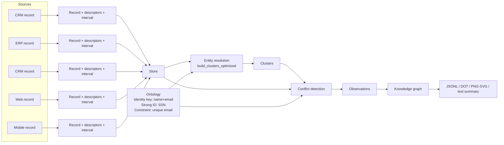

# Unirust

<div align="center">
  
</div>

A temporal-first entity mastering and conflict-resolution engine in Rust.

## What it does

- Model records with explicit validity intervals.
- Resolve entities across multiple sources and perspectives.
- Detect direct and indirect conflicts.
- Export a knowledge graph for auditing and visualization.

## How the basic example flows

The `examples/basic_example.rs` program creates five person records from CRM/ERP/Web/Mobile, defines identity rules (name+email) and a strong identifier (SSN), resolves clusters, detects conflicts, and exports a graph.



## Example output (derived entities)

This diagram reflects the clusters and conflicts produced by running `cargo run --example basic_example` locally.

```mermaid
flowchart LR
  subgraph Cluster0["Cluster 0"]
    R3["R3 (crm:crm_002)\nJane Smith\njane@example.com\n555-5678\n987-65-4321"]
  end

  subgraph Cluster1["Cluster 1"]
    R1["R1 (crm:crm_001)\nJohn Doe\njohn@example.com\n555-1234\n123-45-6789"]
    R2["R2 (erp:erp_001)\nJohn Doe\njohn@example.com\n555-9999\n123-45-6789"]
    R4["R4 (web:web_001)\nJohn Doe\njohn@example.com\n555-0000\n123-45-6789"]
  end

  subgraph Cluster2["Cluster 2"]
    R5["R5 (mobile:mobile_001)\nJohn Doe\njohn.doe@example.com\n555-0000\n123-45-6789"]
  end

  R1 ---|SAME_AS [-inf, +inf]| R2
  R1 ---|SAME_AS [-inf, +inf]| R4
  R2 ---|SAME_AS [-inf, +inf]| R4

  R1 -. "CONFLICTS attr:2 [150, 200)" .- R2
  R1 -. "CONFLICTS attr:2 [180, 200)" .- R4
  R2 -. "CONFLICTS attr:2 [180, 250)" .- R4
```

## Quick start

```bash
cargo run --example basic_example
```

## Add to your project

```toml
[dependencies]
unirust = "0.1.0"
```

## Development

```bash
cargo test
```

## License

MIT. See `LICENSE`.
