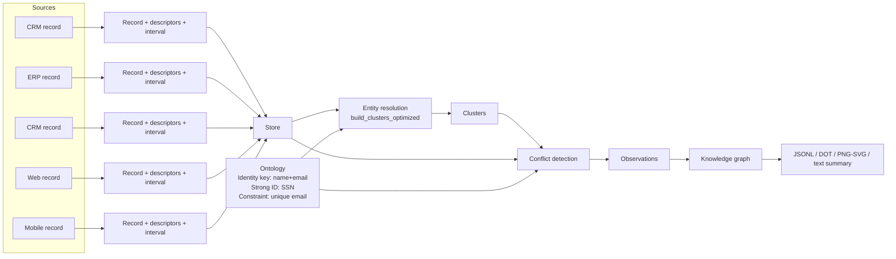

# Unirust

<div align="center">
  
</div>

A temporal-first entity mastering and conflict-resolution engine in Rust.

## What it does

- Model records with explicit validity intervals.
- Resolve entities across multiple sources and perspectives.
- Detect direct and indirect conflicts.
- Export a knowledge graph for auditing and visualization.

## How the basic example flows

The `examples/basic_example.rs` program creates five person records from CRM/ERP/Web/Mobile, defines identity rules (name+email) and a strong identifier (SSN), resolves clusters, detects conflicts, and exports a graph.



## Quick start

```bash
cargo run --example basic_example
```

## Add to your project

```toml
[dependencies]
unirust = "0.1.0"
```

## Development

```bash
cargo test
```

## License

MIT. See `LICENSE`.
