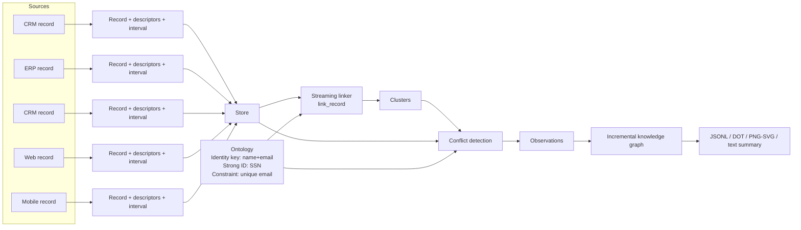
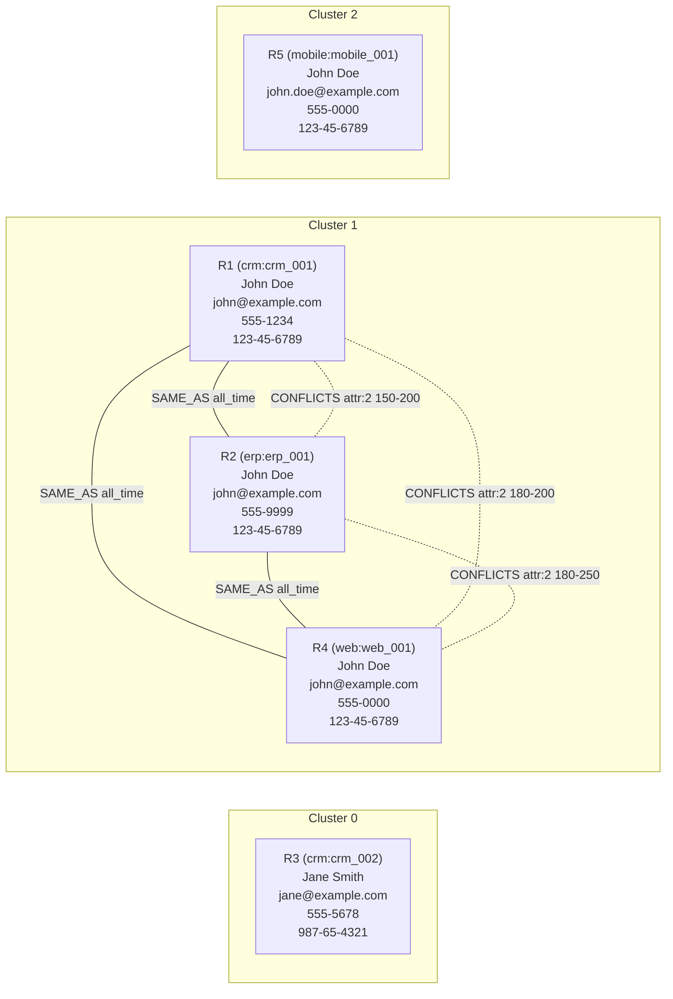

# Unirust

<div align="center">
  
</div>

Temporal-first entity mastering and conflict resolution in Rust.

## Why Unirust

- Time-aware entity resolution across sources and perspectives.
- Conflict detection with explainable observations.
- Conflict-free golden records per cluster.
- Streaming ingest with deterministic clustering.

## How the basic example flows

The `examples/basic_example.rs` program streams five records, defines identity rules (name+email) and a strong identifier (SSN), resolves clusters, and reports conflicts.



## Example output (derived entities)



## Quick start

```bash
cargo run --example basic_example
```

## Tuning

Streaming performance is controlled via `StreamingTuning`.

```rust
use unirust_rs::{StreamingTuning, TuningProfile, Unirust, Store};

let tuning = StreamingTuning::from_profile(TuningProfile::HighThroughput);
// Or customize individual fields:
// let tuning = StreamingTuning { candidate_cap: 2000, ..StreamingTuning::default() };

let mut unirust = Unirust::with_store_and_tuning(ontology, Store::new(), tuning);
```

Available profiles: `Balanced` (default), `LowLatency`, `HighThroughput`, `BulkIngest`, `MemorySaver`.

## Query master entities

```rust
use unirust_rs::{QueryDescriptor, QueryOutcome, Interval};

match unirust.query_master_entities(
    &[
        QueryDescriptor { attr: org_attr, value: org_value },
        QueryDescriptor { attr: role_attr, value: role_admin },
    ],
    Interval::new(0, 30)?,
)? {
    QueryOutcome::Matches(matches) => {
        // Each interval is guaranteed to map to a single master entity.
        // matches[i].golden includes the conflict-free golden descriptors for that cluster.
        // matches[i].cluster_key provides a human-friendly stable key for the cluster.
    }
    QueryOutcome::Conflict(conflict) => {
        // Overlapping clusters; conflict.descriptors includes overlap intervals.
    }
}
```

## Add to your project

```toml
[dependencies]
unirust-rs = "0.1.0"
```

## Development

```bash
cargo test
```

### Benchmarks and profiling

Benchmarks live in `benches/entity_benchmark.rs` and `benches/perf_suite.rs`.

```bash
cargo bench --bench entity_benchmark -- entity_resolution
cargo bench --bench entity_benchmark -- entity_resolution_large
cargo bench --bench entity_benchmark -- entity_resolution_sharded
```

Enable the lightweight profiler (feature-gated) to print hot-path timings:

```bash
UNIRUST_PROFILE=1 cargo bench --bench entity_benchmark --features profiling -- profile_5000
UNIRUST_PROFILE=1 cargo bench --bench entity_benchmark --features profiling -- profile_100k
```

Benchmark notes: see `BENCHMARKS.md`. Testing notes: see `TESTING.md`. Architecture notes: see `DESIGN.md`.

## License

MIT. See `LICENSE`.
